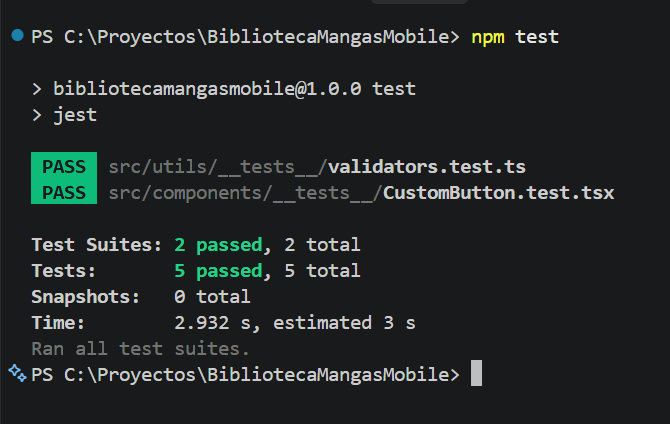

# BibliotecaMangas Mobile

Aplicación móvil desarrollada con React Native y Expo para el primer parcial de Aplicaciones Móviles.

## Opción elegida

Lista de compras inteligente.

BibliotecaMangas Mobile funciona como una lista de deseos de mangas, donde el usuario puede guardar los tomos que desea comprar.

## Funcionalidades

- Registro de usuario local.
- Inicio de sesión con validación de datos.
- Persistencia de sesión.
- Lista de deseos de mangas.
- Alta de mangas.
- Visualización de mangas guardados.
- Eliminación de mangas.
- Persistencia de datos mediante AsyncStorage.
- Validación de datos al agregar un manga.
- Notificación local como recordatorio de compra.
- Cierre de sesión.

## Tecnologías utilizadas

- React Native
- Expo SDK 57
- TypeScrippt
- React Navigation
- AsyncStorage
- Expo Notifications
- Jest
- React Native Testing Library

## Ejecución

Instalar dependencias

```bash
npm install
```

Iniciar Proyecto

```bash
npm expo start --dev-client
```

La aplicación utiliza un Development Build de Expo para poder ejecutar correctamente las notificaciones locales.

## Testing

Para ejecutar los tests:
```bash
npm test
```

Actualmente el proyecto cuenta con 5 tests:
- Renderizado del componente reutilizable ```CustomButton```.
- Ejecución de ```onPress``` en ```CustomButton```.
- Validación de datos correctos de un manga.
- Validación del título obligatorio.
- Validación del número del tomo.

Resultado final: 


